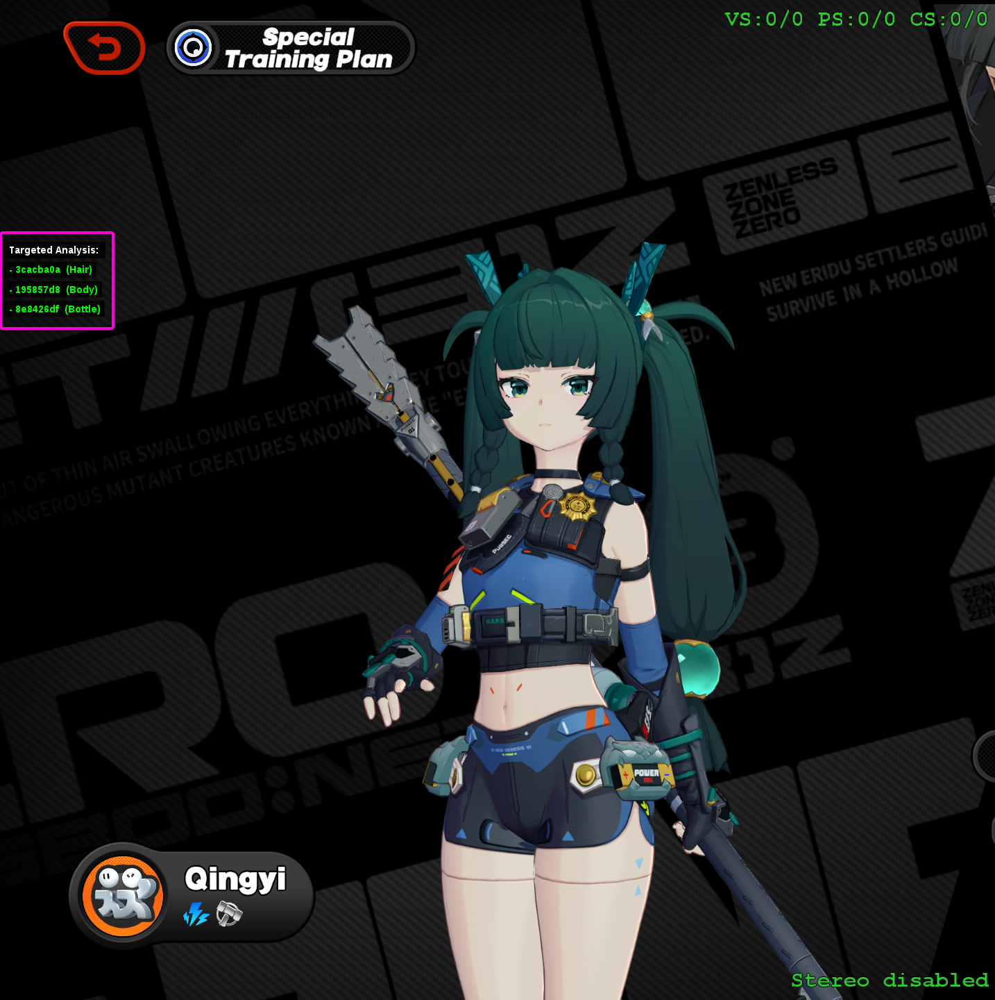

# Advanced hunting & dumping

## Targeted dump

Targeted dump is a technique to do dump only targeted objects, instead of whole scene,
allows to shrink dump folder size from gigabytes to hundreds of megabytes. 

### Targeted dump with gui_collect

If you don't know how to do regular dumps with `gui_collect`, read [that tutorial](../guides/hunting.md) first

Enable target dump in gui_collect


After enabling that you will see next options on extract page


1. is field to find ini with targeting generated code
   - you can find it in `gui_collect/include/auto_generated.ini`
2. generate and fill with targeting code
3. clear that file

---

To integrate that with game you may do 2 things
1. is to add `include` call in `d3dx.ini`
   - it's not recommended, since XXMI updates may remove it
2. create an `ini` with overrides for `d3dx.ini` params
   - example of ini for that:
      - include support relative paths, in example used
      - overrides path: `Mods/Etc/d3dx overrides.ini`
      - generated path: `XXMI Launcher/gui_collect-main/include/auto_generated.ini`
```ini
[Include]
include = ..\..\..\gui_collect-main\include\auto_generated.ini
```

after you added that, press F10 to update configs

If you do a lot of F10 while dumping or making a mod, you may encounter pretty long delay between them,
to speedup them you can enable shader cache.

::: danger
Be aware that it may bring some issues,
main issue is updated shader but old cache, that may run into crashes in rare scenarios.
:::

To enable cache, add that to your overrides ini:
```ini
[Rendering]
cache_shaders = 1
```

---

To use new target, fill sections, and click generate, after that press F10 in game,
now you should see panel with targeted objects that will be included in dump



Press F8, and you're done, in my case, regular dump is 3.4gb, when targeted is 840mb