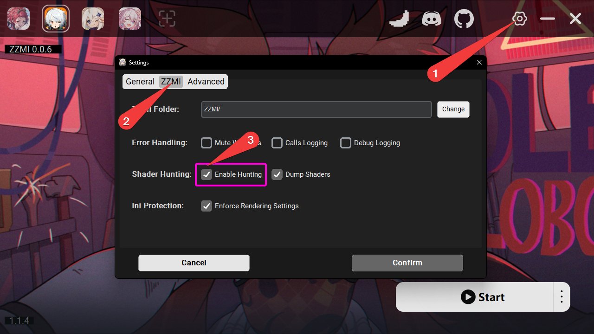

# Tutorial de Caza y Volcado con 3DMigoto

> Escrito por: Satan1c

Este tutorial cubrirá el proceso de caza y volcado.

Esto es útil si deseas crear tu propio mod con recursos que no fueron publicados o están desactualizados,
o para arreglar un mod desactualizado por ti mismo.

Este tutorial recorrerá una descripción básica de los buffers/shaders y un ejemplo de caza y volcado de personajes.

## Requisitos previos

Tener instalado el último [lanzador XXMI](getting-started.md) y [gui_collect](https://github.com/Petrascyll/gui_collect).

Mientras cazas, recomiendo deshabilitar todos los mods, para eso, necesitas presionar `F6`, sin embargo, algunos mods pueden permanecer habilitados,
en la mayoría de los casos son mods de shaders, por lo que es mejor renombrar la carpeta `Mods` o agregar `DISABLED` a las carpetas superiores con mods.

## Configuración del lanzador

Por defecto, los mods pueden no estar habilitados, para habilitarlos, abre la configuración, luego la pestaña MI y habilita la caza,
si necesitas modificar shaders, y no solo obtener un hash nuevo, habilita "Dump Shaders".

## Controles

Después de que el juego comience, en el primer lanzamiento verás un popup con los controles de caza, si no lo ves, presiona `F12`.

Todos los controles se pueden cambiar en `d3dx.ini` bajo la sección `[Hunting]`, con códigos de teclas virtuales válidos [virtual key codes](https://learn.microsoft.com/en-us/windows/win32/inputdev/virtual-key-codes).

## ¡Acción!

### Obtener hashes

Primero, asegúrate de que la caza esté habilitada, presiona `numpad 0`, deberías ver texto verde en la parte superior e inferior de la pantalla.

1. Sección de contadores
   - `VS` - Vertex Shader
   - `PS` - Pixel Shader
   - `IB` - Index Buffer
   - `VB` - Vertex Buffer
   - `CS` - Compute Shader

los números después de ellos muestran `actual`/`conteo total`.

2. Hashes

Muestra el hash que está actualmente marcado y se puede copiar, si se habilitó "Dump Shaders", entonces guardará
el shader en la carpeta `ShaderFixes`.

---

### Volcado

Para obtener un volcado extraído, listo para importar en blender, inicia gui_collect con launch.bat.

Después de que collect comience, verás la siguiente interfaz:
1. Establece la ruta a tu carpeta MI.
2. Lugar para el hash IB copiado de la caza.
3. Nombre de lo que era.
   - usa solo letras y números, no uses espacios ni símbolos no ASCII.
   - el nombre no afectará nada, son necesarios para que el modder y los usuarios entiendan qué parte es,
pero **deben ser únicos**.
   - si IB es responsable de todo el objeto o la mayoría de él, entonces puede estar en blanco,
en GI generalmente hay un IB para el cuerpo que puede estar en blanco.
4. Nombre para todo el objeto, nombre del personaje, etc.
   - usa solo letras y números, no uses espacios ni símbolos no ASCII.
   - bajo el nombre, puedes seleccionar dónde crear la carpeta volcada.
5. Datos del modelo, indica si los datos del modelo *(ib, buf)* estarán en la carpeta volcada.
6. Hashes del modelo, indica si los hashes del modelo se incluirán en el `hash.json` resultante.
7. Datos de textura, indica si las texturas estarán en la carpeta volcada.
8. Hashes de textura, indica si los hashes de las texturas se incluirán en el `hash.json` resultante.
9. Último volcado de fotogramas, selecciona automáticamente la última carpeta de volcado de fotogramas de la carpeta MI elegida.
10. Extraer, abre un diálogo para seleccionar los activos a incluir en el volcado, extraídos del volcado de fotogramas seleccionado.

---

Como ejemplo de volcado, volcaré el modelo de Qingyi.
Una pequeña advertencia, si planeas usar materiales volcados para crear un mod, no vuelques caras,
o no incluyas sus hashes/buffers en el volcado resultante, actualmente la modificación de caras no está completamente soportada,
por lo que si cambias el modelo de la cara, se romperá en el mod, solo la textura de la cara se puede modificar sin ningún problema.

Cuando marcas un hash, el objeto al que pertenece desaparecerá *(método de marcado predeterminado,
como alternativa puedes cambiar marking_mode en d3dx.ini)*.

Obtuve los siguientes hashes y los pegué en collect:
   - `3cacba0a` - Cabello
   - `195857d8` - Cuerpo
   - `8e8426df` - Botella

Para hacer el volcado, necesitas crear una carpeta de volcado de fotogramas presionando `F8` con el modo `hunting`*(texto verde)* habilitado,
antes de eso, asegúrate de haber deshabilitado los mods para el objetivo que deseas volcar.

Después de presionar `F8`, el juego se congelará para crear el volcado de fotogramas, después de que termine, selecciona la última carpeta y extrae.

---

En el diálogo de extracción puedes seleccionar qué texturas y hashes de texturas estarán contenidos en el volcado.
En diferentes juegos, y entre diferentes objetos en el mismo juego, pueden haber diferentes formatos.

Para seleccionar qué textura es de qué tipo, haz clic en ella con LMB y elige de la lista.
Necesitas elegirlas para todos los objetos y hacer clic en "Done".

Cómo identificar texturas:
   - Difusa
      - textura completamente coloreada
   - Normal
      - gradiente, efecto de volumen/bulto notable.
   - Luz
      - textura simple coloreada.
   - Material
      - textura simple coloreada, con algunos detalles.

---

### Resultado

Como resultado, verás la misma carpeta, con las texturas seleccionadas y los archivos ib/vb0 compilados, para importarlos en blender.

