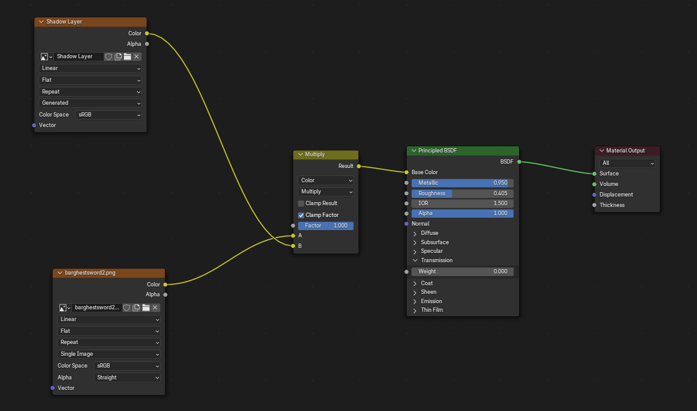
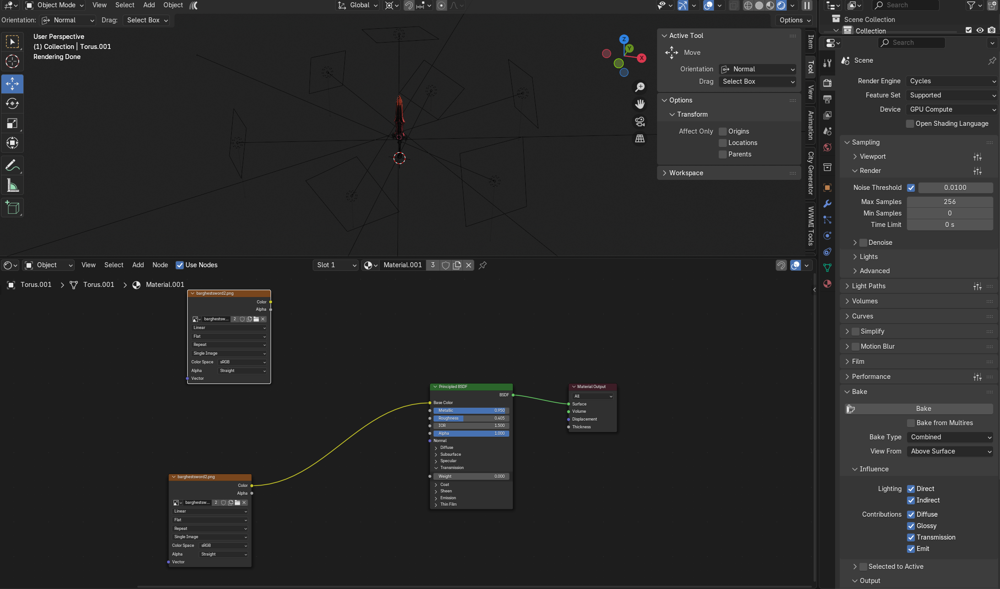

# Blender Materials and Baking

This is an introduction to the blender UI. Please note that for more detailed information, you will need to look at the documentation or watch guides.

## Table of Contents

[[toc]]

## Documentation and Note

This page covers the basics of materials and baking.

For materials, you can find the documentation here:
https://docs.blender.org/manual/en/latest/render/materials/index.html

For Baking, you can find the documentation here:
https://docs.blender.org/manual/en/latest/render/cycles/baking.html

For far more accurate GI/HSR/WW/ZZZ materials than those shown in the guides here, please take a look at the [Omatsuri Discord](https://discord.com/invite/omatsuri-894925535870865498).

## Material Introduction

In Blender, materials allow the user to use shaders, combined with textures, to preview a model. This can be useful for modding, as it allows the modder to preview their textures. 

This is a fairly basic blender material:

Any node in blender, as well as any function, can be accessed by using the `F3` key and typing it in.

### The Principled BSDF Node

This node is the basic shader that will always be created with a default material in blender. It is vital for previews, and will be used in virtually all examples. 

Below are the important settings to remember in a PPrincipled BSDF:
- `Base Color`: The base color of the shader. This is where a diffuse texture would be connected.
- `Metallic`: How metallic the material is. For lightmaps, the Metallic channel would be connected here.
- `Roughness`: How rough, or glossy, the material is. For lightmaps, the gloss map would be connected here.
- `Normal`: The normal value of the material. Normal maps should be connected here.

In most cases for a proper material, the shader should be the last node connected to the `Material Output` node, as it is the output node that Blender displays in the viewport.

### Image Node and Image layers

The image node in this image are the `Shadow Layer` and `barghestsword2.png` nodes, with an orange header.

The only non-standard part of the image is the `Mix` node. Blender, by default, does not have layers for images like photoshop or other image editing softwares This can be overcome with plugins or nodes, as seen in this image. Below is a step by step guide on how to layer images:
- Create the base image.
- Create a blank (white (A), or empty (B)) image.
- Press F3 and enter 'Multiply'. **NOTE:** Multiply acts like multiply in photoshop. For other layer blends, choose the alternative you want.
- Select `Mix Color - Multiply`. This will create a new node.
- Depending on what you do in step 2, do the following:
    - A: Connect the base image into the the A input, and the top layer into the B input.
    - B: Do A, then connect the Alpha of the top layer to the Factor.
- Connect the result into the next node. If you want more layers, connect it into the A of the next `Mix` node, otherwise connect it into the shader node's base color.

If you want to bring all the layers together, you can **bake** the texture. View the Baking section below.

## Baking

To bake a texture, do as follows:
- Set up your scene, including the lighting, in Blender.
- In `Render Properties`, ensure the Cycles Render Engine is selected.
    - To ensure a quick bake, it is strongly recommended to set your device to cycles.
- In `Sampling` > `Render`, ensure that Denoise is disabled and that max samples is set somewhere between 256-512 samples. The default 4096 is far more than necessary.
- In `Bake`, ensure the `Bake Type` setting is set to 'Combined' and the `View From` setting is set to 'Above Surface', and that all lighting influences are on.
- Make sure all nodes are properly connected.
    - **NOTE**: To bake the layers of a texture, if you do not want the material's shading to affect the textures, simply connect the output of the last `Mix` node to the Material Output.
- Create a new `Image` node and create an image (Preferably the same size as the base texture).
- Select the image node (it should be highlighted in white).
- Bake!
- Save the texture.

Here is an example of a material that is about to be baked. Please note that the shader is also being baked into the texture here:
