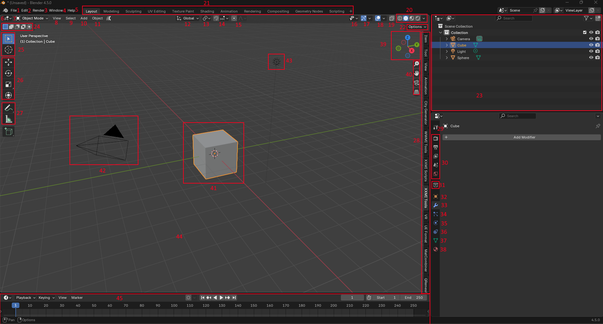

# Blender UI

This is an introduction to the blender UI. Please note that for more detailed information, you will need to look at the documentation or watch guides.

## Table of Contents

[[toc]]

## Documentation

For more advanced documentation on these modifiers and other modifiers, please see:
https://docs.blender.org/manual/en/latest/interface/index.html

## Videos

For a video on the UI basics for blender, you can watch this:
https://www.youtube.com/watch?v=8XyIYRW_2xk

**Note:** Blender has a massive UI overhaul in 2.80. Any videos after this date are usually accurate, any videos before this are mainly inaccurate.

## Main view

Please view the IDs in the image to view the explanation of the element below the image. You can click on the image to open it in another page and zoom in.

Since the blender UI is very detailed and has many options, if an explanation goes in-depth on a menu button, it will only go into the necessary options for modding.

1. `File`: This tab holds several file settings:
    - `New`: Create new blender projects
    - `Open`/`Open Recent`: Open existing blend files
    - `Recover`: Recover autosaves, this is useful if blender crashes
    - `Append`: Add data from other blend files
    - `Import`: Import models (XXMI Plugin uses this)
    - `Export`: Export models
2. `Edit`: Edit is where you install plugins, set settings, and can undo/redo and view history.
3. `Render`: Used for rendering, not important in the case of modding.
4. `Window`: Open new windows. You can also toggle the system console here, useful for debugging and finding errors on export.
5. `Help`: Opens documentation
6. `Editor type`: You can change editor here. This button will always show up in the top left corner of a widget. Here are the key editors:
    - `3d Viewport`: The primary viewport to view models and do 3d things. Should essentially always be open in a widget.
    - `Image Editor`: Allows the user to view and edit images. Useful for texture painting.
    - `UV Editor`: Allows the user to view and manage UVs. Vital for UVs
    - `Shader Editor`: Allows the user to edit materials in a node graph fashion. Useful for baking and allowing the user to preview lightmaps/normal maps.
    - `Outliner`: Also `23` on the image. Allows the user to structure a scene.
7. `Mode selector`: Allows the user to change mode. Modes are as follows:
    - `Object Mode`: Viewing objects and editing at the object level.
    - `Edit Mode`: Editing objects at the vertex level.
    - `Sculpt Mode`: Sculpting objects. Usually for more advanced users.
    - `Vertex Paint`: Painting the vertex color of an object.
    - `Weight Paint`: Weight painting. Vital for getting an object to move in a mod.
    - `Texture Paint`: Texture painting on the mesh itself in the 3d viewport.
8. `View`: Adjust what elements of the UI are visible.
9. `Select`: Select objects in the 3d viewport.
10. `Add`: Add objects. In the case of modding, very rarely do things outside of mesh, armature and occasionally curve interest us.
11. `Object`: Adjust an object, whether it be by moving it, adding modifiers, changing it's parent, it can all be done in this menu, however, the UI is lacking in exchange for the amount of options to fit in.
12. `Transform orientation`: Change the transform orientation of an object. It is recommended to learn the `Global`, `Local` and `Normal` transform orientations.
13. `Transform pivot point`: Changes the pivot point when rotating or scaling a mesh:
    - `Bounding Box Center`: Center of a selection
    - `3D Cursor`: Around the 3D cursor (The red and white circle)
    - `Individual original`: If multiple objects are selected, each object will rotate around it's own center.
    - `Median Point`: Around the middle point of all selections.
    - `Active Element`: Around the active element (highlighted in yellow as opposed to orange)
14. `Snapping`: Allows an object to snap, either in increments or to the surface of another object. View docs for more detail.
15. `Proportional editing`: Will influence objects or vertices surrounding the selected object/vertex proportionally to it's distance. (The proportional influence can be modified by editing the line graph).
16. `Selectability and Visibility`: Adjust what shows in the 3D viewport.
17. `Viewport Gizmos`: Enables/Disables the gizmo, which allows rotating the viewport.
18. `Viewport Overlays`: Allows to enable/disable various overlays. It is here you can enable/disable wireframe and face orientation, along with statistics for vertex count.
19. `Transparency Overlay`: Allows the user to make objects transparent, ie see through them. 
20. `Viewport Shading`: Changes the shading type of the viewport: 
    - `Wireframe`: Shows all meshes as wireframes.
    - `Solid`: The default when blender opens. Shows all meshes with basic lighting.
    - `Material Preview`: Displays meshes using eevee, with materials on.
    - `Rendered`: Attempts to show the viewport as close to a render as possible, by default uses Cycles. Not recommended to view in this mode when modding.
21. `Tabs`: These are the tabs in blender, each allowing you to set up the widgets in a different way as well as having different editors in each. By default, the ones in the image are already in a new blend.
22. `Options`: Options for the current mode selected in the 3D viewport.
23. `Outliner`: Allows the user to structure a scene.
24. `Selection Mode`: The same modes as most image editors, that let you select and add/substract/difference/intersect with an existing selection.
25. `Selectors`: The first icon is the selector type. These can be cycled with the `W` key. The second icon is the 3d cursor tool, which lets the user changes the location of the 3d cursor.
26. `Transform tools`: From top to bottom:
    - `Move`: Move an object
    - `Rotate`: Rotate an object
    - `Scale`: Scale an object
    - `Transform`: All 3 together.
27. `Annotate` and `Measure`: `Annotate` Allows the user to draw in the viewport with the grease pencil. `Measure` allows the user to measure distances. Useful for getting the scale of things correct.
28. `Sidebar`: Where most plugin menus are located, **including XXMI and WWMI**. Other useful tabs include the `Tool` tab for tool properties and `View` tab for camera properties.
29. `Tool`: Allows the user to modify tool properties of the active tool.
30. `Rendering settings`: Various rendering settings. Not useful for most beginner modders, outside of baking.
31. `Collection`: Settings for the collection the object is in. In the image, the selected cube is in the `Collection` collection.
32. `Object Properties`: The user can set transform, visibility, shading among other settings here.
33. `Modifier Properties`: This is where the user can add, modify and remove modifiers to an object.
34. `Particle Properties`: Particle settings. Not useful for modding.
35. `Physics Properties`: Physics settings. Not useful for modding.
36. `Constraint Properties`: Constraint settings. Not useful for modding outside specific cases.
37. `Object Data Properties`: The object's data can be found here. This is where the user will find all the information of an object when it comes to Vertex Groups, Shape Keys, UV Maps, Color Attributes and other properties. It is **VITAL** to know the location of this tab.
38. `Material Properties`: Where material properties are found. A user can add and remove materials here, as well as edit basic properties. For more advanced material editing, it is recommended to use the Shader Editor.
39. `Orientation Gizmo`: Gizmo for orientation. Click and drag to rotate the view.
40. `Movement tools`: Used for movement of the view, whether it be zooming in, out, moving it in the 3D space, quickly changing to the camera view or changing projection type.
41. `Cube`: The default blender cube.
42. `Camera`: The default blender camera. Used as the camera when rendering.
43. `Light`: The default blender point light. Used as lighting when in rendering mode or rendering.
44. `3D viewport`: The primary viewport to view models and do 3d things. Should essentially always be open in a widget.
45. `Timeline`: For animating. Not useful for modding.