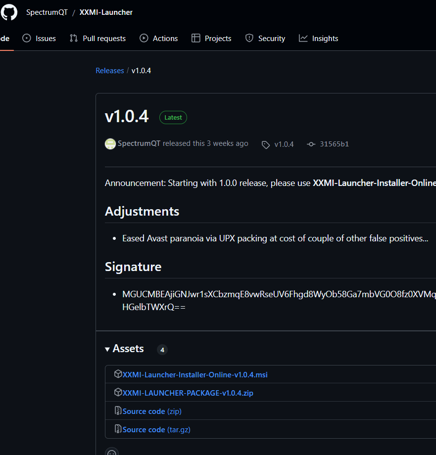

# Getting Started

## Quick Start Guide

1. Download and install the latest version of the [Launcher](https://github.com/SpectrumQT/XXMI-Launcher/releases/latest)

2. Open the launcher, select your game of choice, and click "Start"

- You will be presented with this screen that teaches you the basic keybinds to use 3dmigoto. Read it carefully and press the key mentioned to close it.

3. **Done!** You're now playing with mods active (Sucrose cursor not included)

---
You might be wondering how it can be this simple. As a matter of fact, it is! The launcher will automatically download and install the necessary configurations for you, so you can focus on playing the game and acquiring the mods of your preference.

## Installing your first mod

1. Head over to your modding site of choice. We recommend [gamebanana.com](https://gamebanana.com) but sites like [nexusmods.com](https://nexusmods.com) or [loverslab.com](https://loverslab.com) are also good sources.
    - [GI mods](https://gamebanana.com/games/8552)
    - [WW mods](https://gamebanana.com/games/20357)
    - [HSR mods](https://gamebanana.com/games/18366)
    - [ZZZ mods](https://gamebanana.com/games/19567)
2. Browse the site and download the mod you want to install. They tend to be in a `.zip` file (or similar) with all the necessary files inside.
3. Open the launcher, click on the "Open Mods folder"

4. [Extract the zip file](https://www.google.com/search?q=how+to+extract+a+compressed+file) you downloaded into the mods folder
5. Head over to your game and press F10 to hot reload the mods.
6. Done! You're now playing with your first mod active.

It is worth mentioning that some mods might require you to download other mods to function or even install them in specific folders. Make sure to read the mod's description to know if that's the case.

::: danger
Be mindful of your security when downloading mods. Always make sure to download from trusted sources. Mods are only composed of `.ini` files, textures, and 3D models of `.buf` extension. If any mod asks you to download an executable file (`.exe`) or `.dll`, it's likely a virus. There are exceptions to this rule, such as tools or fixes that require `.py` or `.exe` files to run. Read more about it [here](./troubleshooting.md#fixing-mods)
:::

## Migrating from GIMI/HIMI/SRMI/ZZMI

If you are coming over from the old modding tools, you simply need to install the launcher as the steps above explain and move the content of your `/Mods` folder to the new mods folder. You can find out where it is by clicking on `Open Mods Folder` in the launcher.

Once done, you can simply press F10 in-game to reload your mods and you're good to go!
