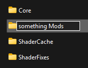
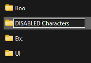
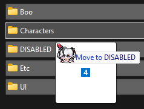

# 3DMigoto Hunting & Dumping Tutorial

> Writen by: Satan1c

This tutorial will go through the process of hunting & dumping.

This is useful if you want to create own mod with resources that wasn't published or outdated, or to fix outdated mod by yourself.

This tutorial will walk through bare description of buffers/shaders description and examples of weapon and character hunting for dumping.

## Prerequisites

Have latest [XXMI launcher](getting-started.md) and [gui_collect](https://github.com/Petrascyll/gui_collect) installed.

While hunting, I do recommend to disable all mods, for that, u need to press `F6` however some mods may remain enabled, in most cases it's shader mods, so better to rename `Mods` folder or add `DISABLED` to the highest folders with mods

  

## Important Note

By default, mods may not be enabled, to enable them, open settings, then MI tab and enable hunting, if you need to modify shaders, and not just get fresh hash, enable "Dump Shaders".

## Controls

After game started, on first launch you will see popup with hunting controls, if you don't see it, press `F12`.

All controls can be changed in `d3dx.ini` under `[Hunting]` section, with valid [virtual key codes](https://learn.microsoft.com/en-us/windows/win32/inputdev/virtual-key-codes).

## Action !

### Getting hashes

First of all, make sure hunting is enabled, press `numpad 0`, you should see green text on top and bottom of the screen.

1.Counters section
   - `VS` - Vertex Shader
   - `PS` - Pixel Shader
   - `IB` - Index Buffer
   - `VB` - Vertex Buffer
   - `CS` - Compute Shader

numbers after them displays `current`/`total count`

2.Hashes

Displays hash that currently marked and can be copied

