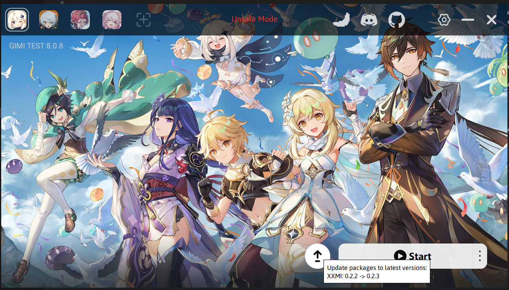

# Launchers

Launchers can help you set up your 3dmigoto configuration faster and without much hassle. You might have seen me recommend XXMI Launcher in the quick started guide already. That launcher is developed by SpectrumQT whom works in the AGMG community alongside me and other developers. It reduces the complexity of getting started with mods to mere plug and play while also serving as an auto updating tool. As the games update, some mods break and fixes are required, prior to the use of this launcher said fixes had to be manually excecuted by the user and installed in the proper places which lead to a lot of user side mistakes and confusion.

## Other Launchers

Apart from XXMI Launcher, there are other communities creating their own. Personally I can't recommend any and some I even actively advice against due to the fact they monetize something that is free and open source without adding any value on top of what is already readily available elsewhere. Exercise caution when downloading and using other launchers. As a rule of thumb avoid paid options and ones that don't openly share their source code, as they might be injecting code on the back without you knowing.

## XXMI Launcher

I will elaborate on the utility and functionality of this one in particular however other launchers will more likely have all the same functionality built-in in one form or another.

### One-click updates

The launcher will automatically check for updates and download them for you. This is a great feature as it ensures you are always up to date with the latest fixes and improvements. If you disable auto updating, they will show on the main screen and you can manually update them at your own pace.

### Reshade - FPS unlocker support

FPS unlocker comes built-in with the launcher for the games that can make use of it. Activating it is as simple as selecting your target FPS in the settings. Upon game relaunch, the FPS unlocker will be active and you will be able to enjoy your game at the desired frame rate.

As for reshade it does not come built-in but setting it up tends to be quite simple.
Here is a guide by caverabbit on the subject: <https://gamebanana.com/tools/18082>

### Adding functionality to the launcher

In the ADVANCED tab within your settings, you can set up pre and post scripts/programs to run before and after the game starts. This can be used to launch any other program that you might be interest to use alongside mods. Reshade is an example of this. Personally I've written a python script that randomize which outfit my character will use for the gaming session. The possibilities are endless. Feel free to experiment and brainstorm ideas with the community. Even if you consider yourself uncapable of making it, someone else might be able to help you out. Modding doesn't have to be limited to the 3D models only. Whatever that adds flavour to the experience is welcomed.
