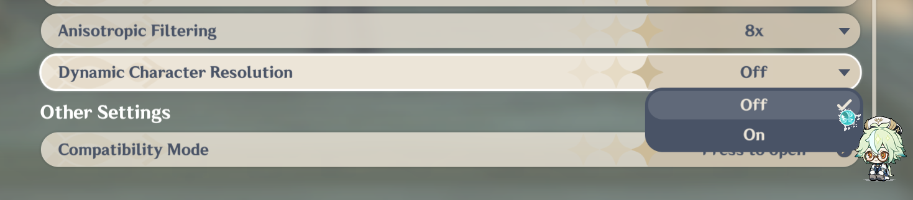

# Fixing mods

As time goes on and games update, there are times where mods break due to resource updates and all kinds of technical shortcommings. Usually, toolsmaker will converge to craft easy to use fixes that update mods to the current version of the game. At least for the more popular elements of the game.

::: danger
Do not rush to download the first file you find online, malicious actors tend to take advantage of the situation and upload fake fixes that will harm your computer. Always make sure to download from trusted sources.
:::

Here is a list of trusted developers that provide fixes for mods:

- [SilentNightSound](https://gamebanana.com/members/2176153)
- [Petrascyll](https://gamebanana.com/members/2644630)
- [Gustav0](https://gamebanana.com/members/2890460)
- [SpectrumQT](https://gamebanana.com/members/2837527) - Specializes in WW fixes
- [sora_](https://gamebanana.com/members/1367828) - Specializes in HSR fixes
- [Thoronium](https://gamebanana.com/members/3210319) - Specializes in "reverse" fixes for private servers

## General troubleshooting

### The halves method

When you have an issue and you don't know which mod is causing it, you can use the "halves method" to track down the problematic mod. Here's how it works:

    1. Move half of your mods to a different folder
    2. Start the game
    3. If it works, move half of the remaining mods back
    4. If it doesn't work, move the other half of the mods back
    5. Repeat until you find the problematic mod

Mathematically speaking, this method is the most efficient way to find a problematic mod(no more than 7 iterations).
Some times there are no mods breaking things and instead the conflict is caused by some file in `/ShaderFixes`. If removing all mods from your `/Mods` folder doesn't fix the issue, then using this method in `/ShaderFixes` is the way to go.

### Mod doesn't load at all

Ensure **3DMigoto** is actually running, and that you have placed the mod in the correct Mod folder. Also make sure to press `F10` in-game to reload any changed mods. Finally, if all else fails try emptying your **/ShaderCache** and **/ShaderFixes** folders, since sometimes those can cause issues when loading mods.

### Large number of warnings(orange text) about mod conflicts

This is caused by the game attempting to load more than one file to the same hash. This usually is a result of using two mods for the same character at the same time.

To fix, remove any duplicate mod folders. If you are sure that you have removed them all and the warnings still show up, go into the **.ini** file the warning mentions and delete or comment out the lines.

### Game crashes when I try to start it

Make sure you have the latest version of the launcher, game and mods installed. If all else fails you can try the ["halves method"](#the-halves-method) to track down the problematic mod. Once identified you can diagnose its issue or ask for help in the [Discord server's #mod-help channel](https://discord.com/channels/971945032552697897/995556765179596890), more advanced users will be glad to lend a hand. Alternatively you can simply get rid of the mod and wait for an update or fix to be released.

### Mod renders partially or collapses into itself

Due to technical limitations when a mod is first loaded, is best to avoid having the character on screen.

This is a known issue and we are working on a more sofisticated fix.

To fix it you simply need to reload your character/object in memory, the safest way to achieve this to restart the game. Alternatively you can try hiding the character/object in question from the camera and teleport away or load a new stage. It should clear enough of your memory to force your character/object to reload.

### Mod loads, but does not show up in game / Errors when loading mod(yellow text)

Unlike warnings, errors usually indicate that the program has failed to load in the mod. The cause can vary, but some common ones are:

- Incorrect names (name in .ini file does not match file in folder, like different extension)
- Textures have wrong format (look at original to see what format, usually dds and must have heights/widths that are powers of 2 and have integer ratios like 1024x1024, 2048x2048, 1024x2048, etc.)
- Did not paint/transfer any vertex groups on the new model, when the old model had vertex groups

### Objects load in with the wrong orientation

This is because the object in blender imported by the **3DMigoto** and the one you are replacing it with are using different coordinate spaces. Even if they seem to line up in blender, you may actually need to rotate and translate relative to the **3DMigoto** model to get the correct orientation. Most commonly, rotate character models 90 degrees so they are facing upwards, then select all and apply all transforms.

Example of correct orientation between original (Kazuha) and new (Noelle)

### Model is completely FUBAR
  
Very likely due to vertex group issues. The vertex group number, order and positions need to match up between the new model and the old. Confirm that all the vertex groups are there in the new model, that they are in the correct order (e.g. 4 6 7 8 5 should be 4 5 6 7 8) and that there are no gaps (e.g. 4 7 8 9 -> 4 5 6 7 8 9), if there are gaps, fill them with new empty vertex groups.

### Model is slightly FUBAR

Still vertex group issues - double check the above, as well as ensure that the weight for the new model in that section matches up with that of the original model

### Incorrect textures

This can be due to a large variety of reasons. Most common ones are:

- Not naming the uv map as TEXCOORD.xy
- Reversed normals
- Damaged or incorrect ObjectTexcoord.buf
- Forgot to replace textures with new ones, so it is still loading up the old ones from the original model
- Very bright/glowing textures

This is most likely due to the texture map you are using having no alpha channel. Refer to the walkthroughs on this repo for details, but basically make sure you have a transparent layer on top of any texture files (the top layer is used to control emission and makes things bright, the bottom layer is used to draw the model colors and patterns).

### Private servers and game versions

If you are using a private server, chances are that the mod you downloaded was not made for an old version like the one you are using. Therefore you will need to "unfix"/downgrade the mod to the version you are in. There are "reverse fixes" that achieve this, but they are not as common as the regular fixes. You can ask for help in the [Discord server's #mod-help channel](https://discord.com/channels/971945032552697897/995556765179596890) for specifics.

## Genshin Impact

### [GI] Mod renders like a mess of geometry

In version 4.1 DCR (Dynamic Character Resolution) was introduced and it breaks the rendering of mods when enabled. To fix the issue simply disable it in the graphic configuration of your game. Some video card driver updates or software like Nvidia Geforce Experience might force-enable it, so make sure to check it every time you see this issue happening.


### [GI] Mesh should be transparent but the mesh is still opaque

The modern method to make a mesh transparent consist of using a library called **TexFX**, it comes installed by default with **XXMI Launcher**. If you are using a traditional **3DMigoto** install you might need to manually install **TexFX** as well. For an updated guide on the subject [read about it here](https://gamebanana.com/mods/485763)

### [GI] Character's reflection/outline has the wrong coloring

This is caused by the game rendering pipeline. Thankfully there is an universal solution called `ORFix`(Outline and reflection fix). If you are using **XXMI Launcher** to mod the game, said solution comes installed by default and you simply need to activate it in your mod.

There is an auto apply script to solve this problem for the average user: <https://gamebanana.com/tools/16472> (recommended)

If you are a mod maker or you want to manually add this to your mod, [read more about it here](https://github.com/leotorrez/LeoTools/blob/main/guides/ORFixGuide.md).

Next section talks about wrong bugs caused by wrong use of this tool.

### [GI] Character has green skin or multi-colored face

If any part of your mod appears incorrect, it means that the modder or user has used the tool incorrectly or made a mistake.
ORFix should be applied exclusively to parts that have a NormalMap.

For example, in the case of Faruzan:

- Body and Head have a NormalMap, so ORFix can be applied.
- Dress does not have a NormalMap, so applying it in this case would be incorrect.

The same principle applies to face-related issues (Face issues). ORFix calls should not be made on Faces.

To fix, open the mod INI file and search for the lines `run = CommandList\global\ORFix\ORFix` in the parts that are using the tool incorrectly and remove.

Alternative solution is to use the script from this post in the mod folder you want to fix — it should work in 95% of cases.
<https://gamebanana.com/tools/16472>

### [GI] Character or their outline is sunk into the floor

Similar to the last issue, this is solved by installing some required files into your **3DMigoto** folder. You can [download the fix from here](https://github.com/leotorrez/LeoTools/releases/tag/offset-scaleChangerV3). To install it uncompress the files into your **3DMigoto** folder and press `F10` to reload the mods.

## Zenless Zone Zero

### [ZZZ] V-Sync activated delays user input up to a second or more

This one is new for me and is the least researched of the bunch. I will be investigating and trying to replicate it, for the time being you can try setting fps to 60 or turning off vsync to overcome it.

### [ZZZ] Models disappear when I walk a bit away from them

That is LOD triggering and there is not thing modding tools can do to stop it from happening. What it does is to load a lower quality version of the model and its textures as you get further away. In order to combat this you "could" get the hashes of the LOD model and make a new ini for your mod to also apply over that model, however this process is very tedious to do manually and tedious to automatize.

### [ZZZ] Mod texutures/model doesn't load

 Devices under 6GB VRAM are forced to use 1K textures and mods are designed to work on 2k textures hence some mod textures look broken. Current fix scripts patch mods to solve this issue for you as well as updating them to the current version.

### [ZZZ] Jane Doe's face is broken

This issue is caused with a conflict with Lucy's mods. To fix it the author of the mod will have to update it to avoid said conflict. However if you are comfortable editing ini files you can update it yourself.

Track down the `LucyHairPosition` texture override in the mod's ini file. It should look something like this:

```ini
[TextureOverrideLucyHairPosition]
hash = ...
handling = skip
vb0 = ResourceLucyHairPosition
vb2 = ResourceLucyHairBlend
draw = 3079,0
```

You must replace it for a `LucyHairBlend` texture override, keep in mind its hash will be updated in the process to `5315f036`

```ini
[TextureOverrideLucyHairPosition]
hash = 5315f036
handling = skip
vb2 = ResourceLucyHairBlend
if DRAW_TYPE == 1
    vb0 = ResourceLucyHairPosition
    draw = 3079,0
endif
```

## Honkai Star Rail

### [HSR] 3.2 update, mod is not auto-fixed

Mods for 3.2 can be either auto fixed, fixed by the mod author or you can fix them yourself manually. To do the last one proceed as such:
Finding `Position` or `Blend` override section, by its hash or name, and add `;` at the beginning of each line, so it should look like that:

Converting `Position` to `Blend` sections can be done by the script with the `-sbp` flag, in CLI.

Alternatively, you can do it manually, by finding `Position` override section, by its hash or name, and add `;` at the beginning of each line, so it should look like that:

```ini
;[TextureOverrideMydeiBodyPosition]
;hash = 4aaeda33
;vb2 = ResourcecMydeiBodyBlend
;vb0 = ResourcecMydeiBodyPosition
;handling = skip
;draw = 54043, 0
```

Then you need to add few `Resource` sections at the bottom of file, usually `Position` `stride` is `40` and `Blend` `stride` is `32`, to check it, you can find existent `ResourceMydeiBodyPosition` & `ResourceMydeiBodyPosition` sections

Then you need to add few `Resource` sections at the bottom of file, and create `Constants` section, or add to existent, `$_blend_` variable. usually `Position` `stride` is `40` and `Blend` `stride` is `32`, to check it, you can find existent `ResourceMydeiBodyPosition` & `ResourceMydeiBodyPosition` sections.
Value for `array` parameter you can calculate by yourself, look at position `.buf` file `size`, not "on disk", and divide it by Position `stride`, for example `2161720 / 40` = `54043`.

```ini
[ResourceMydeiBodyPositionCS]
type = StructuredBuffer
stride = 40
filename = MydeiBodyPosition.buf

[ResourceMydeiBodyBlendCS]
type = StructuredBuffer
stride = 32
filename = MydeiBodyBlend.buf
```

After that, you can edit `Blend` & `VertexLimitRaise`(aka `draw_vb`) override section, by adding all required new features.
Value for `$\SRMI\vertex_count =` parameter you can calculate by yourself, look at position `.buf` file `size`, not "on disk", and divide it by Position `stride`, for example `2161720 / 40` = `54043`

```ini
[TextureOverrideMydeiBodyBlend]
hash = 2506e1cf
vb2 = ResourceMydeiBodyBlend
if DRAW_TYPE == 1
 vb0 = ResourceMydeiBodyPosition
 draw = . . .,0
endif
if DRAW_TYPE == 8    
 Resource\SRMI\PositionBuffer = ref ResourceMydeiBodyPositionCS
 Resource\SRMI\BlendBuffer = ref ResourceMydeiBodyBlendCS
 $\SRMI\vertex_count = . . .
endif
```

Here you need to add `uav_byte_stride = 4`
If `override_vertex_count` or `override_byte_stride` is missing in your conversion, add them manually. `override_byte_stride` is always `40`, and `override_vertex_count` must match the previous `\SRMI\vertex_count` value.

```ini
[TextureOverrideMydeiBodyVertexLimitRaise]
hash = d2fa0357
override_vertex_count = . . .
override_byte_stride = 40
uav_byte_stride = 4
```
