# Советы по 3D-моделированию

> Written by [Anilyan](https://anilyan.ccard.co)

Эти советы в основном для новичков. Важно иметь базовое представление о том, как ориентироваться в Blender. Это касается моделирования, поэтому советы по текстурам и UV-разверткам не будут охвачены.

Многие из этих советов применимы только в определённом режиме — Object Mode (Режим объекта), Sculpt Mode (Режим скульптинга) или Edit Mode (Режим редактирования). Чтобы перейти в Edit Mode (Режим редактирования), нажмите клавишу Tab или выберите его вручную через выпадающее меню с режимами.

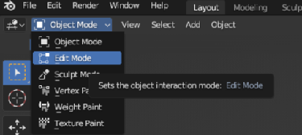

## Очистка от лишних вершин — Edit Mode (Режим редактирования)

Сделайте это сразу после импорта модели для каждого элемента в боковой панели.

Рядом с выбором режима вы увидите 3 иконки, изображающие куб с различными выделенными частями. Они обозначают выбор вершин, рёбер и граней соответственно. Выберите Vertex Select **Выбор вершин**.

Вы увидите множество беспорядочных точек, которые не принадлежат выбранной части. Чтобы избавиться от них, зайдите в **Mesh » Clean Up » Delete Loose / Сетка » Очистить » Удалить лишние**.

**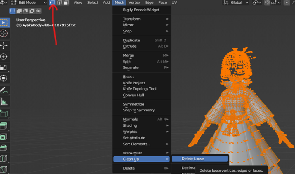**

## Преобразование треугольных граней в квадраты — Edit Mode (Режим редактирования)

**В Face Mode (Режим граней) нажмите A, чтобы выделить все, затем правой кнопкой мыши выберите Tris to Quads.** Это преобразует треугольные грани обратно в квадраты. Имейте в виду, что следует также проверить некоторые параметры, чтобы не повредить UV-развёртку.

Это позволит вам легче выделять петли и выполнять другие действия.

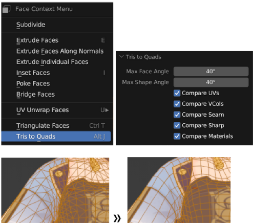

## Разделение элементов или граней — Edit Mode (Режим редактирования)

Есть 3 ситуации:

1\) Вы хотите выделить определённые части модели, чтобы отделить их. Далее будут даны советы по ручному выбору. После этого **нажмите P » By Selection (По выбору)**. Новый элемент появится в Scene Collection (Коллекции сцен).

2\) Возможно, ваш объект состоит из нескольких материалов, или вы объединили 2 элемента, использующие разные материалы, поработали с ними, но затем поняли, что нужно снова их разделить по какой-то причине, например, для настройки UV. В этом случае **выделите все (A), затем нажмите P » By Material (По материалу).**

3\) Разделить всё, что не связано: **A » P » Separate by Loose Parts (Разделить по незакреплённым частям).**

**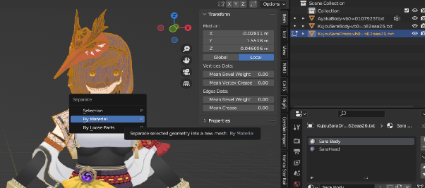**

**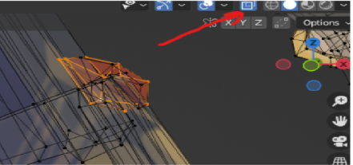**

## Просмотр обеих сторон модели - любой режим

Этот значок позволяет вам видеть обе стороны модели. Особенно полезно, если вы пытаетесь удалить вершину и замечаете, что в Genshin, из-за отсутствия связей между гранями, может быть несколько вершин в одном месте. Также полезно, если вы хотите выделить объекты с обеих сторон модели.

**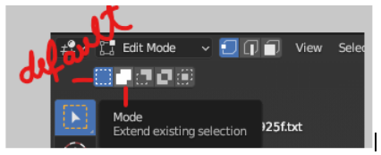**

## Расширение или вычитание существующего выделения - Режим редактирования

Эти значки позволяют вам определить, будет ли новое выделение заменять, добавлять или вычитать элементы из уже выбранных. Вы также можете нажать Shift, чтобы добавить к существующему выделению в первом режиме.

Вы также можете оставить по умолчанию и, выбирая новые грани, удерживать Shift, чтобы расширить выделение или удерживать Ctrl, чтобы вычесть.

**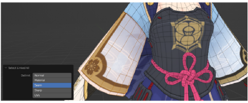**

## Слияние по расстоянию - Режим редактирования

Выберите любые объекты в режиме редактирования, затем нажмите M » По расстоянию » выберите малое значение, например 0.0001.

Вы также можете выбрать другую опцию (например, Слияние в центре).

Используется: Многие типы выделений требуют связанных граней, которых нет у всех моделей, поэтому это поможет соединить смежные грани/рёбра или перекрывающиеся вершины. Также может быть полезно для закрытия отверстий или исправления вершин, которые вы случайно разделили.

Минусы: Если вы сливаете больше объектов, чем нужно, это может вызвать трудности при их разделении. Также вы можете повредить нормали/затенение граней, так как причина разделения граней одной части модели по умолчанию заключается в том, чтобы каждая подсекция имела нормали, направленные в разные стороны. Однако вы можете частично восстановить это позже, добавив острые рёбра или снова разделив некоторые грани — смотрите раздел теней.

## Выбор связанных граней - Режим редактирования

Ctrl+L (после выбора объекта в режиме редактирования): Позволяет выбрать все связанные грани/рёбра/вершины.

Вы также можете выбрать, хотите ли вы связать части по UV (с одинаковой областью в UV-картировании), по швам, острым углам (если у вас есть швы или острые рёбра), или по другим параметрам. Полезно, если вы объединили вершины, но один из этих факторов облегчает их разделение.

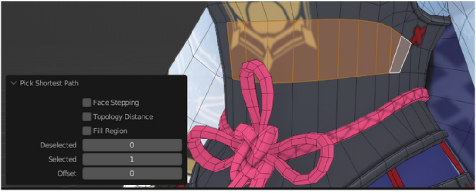

## Выбор пути между 2 гранями/рёбрами/вершинами - Режим редактирования

Выбор одной вершины/рёбра/грани, удерживая Ctrl, а затем выбор другой вершины/рёбра/грани, которая не соединена напрямую, но находится в той же связанной области, выберет весь путь, соединяющий их.

Если это не работает, возможно, существуют разделённые грани, которые мешают соединению. Возможно, вам стоит рассмотреть слияние по расстоянию, как было показано выше.

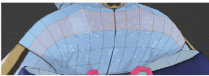

## Выбор петли - Режим редактирования

**Alt+L + выбрать:** Выбор петли рёбер. Это работает только если вы работаете с квадратиками/квадратами вместо треугольников.

Если это не работает, возможно, разделённые грани мешают соединению. Возможно, вам стоит рассмотреть слияние по расстоянию, как было показано выше.

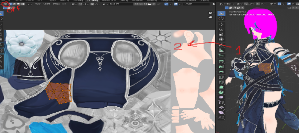

## Выбор на основе UV - Режим редактирования

(также полезно при работе с текстурами)

Как я показывал выше, как можно выбрать заданную область UV с помощью Ctrl+L, вы также можете быть более точными в вкладке UV Mapping. Чтобы увидеть, что отображается на какой части текстуры, и выбрать то, что вам нужно.

Это двусторонний процесс, в зависимости от того, выбрали ли вы эти стрелки (иконка, окруженная вверху экрана):

(картинка 1) выключено, при выборе на модели вы видите выбор на карте
(картинка 2) включено, при выборе на изображении вы видите его на модели

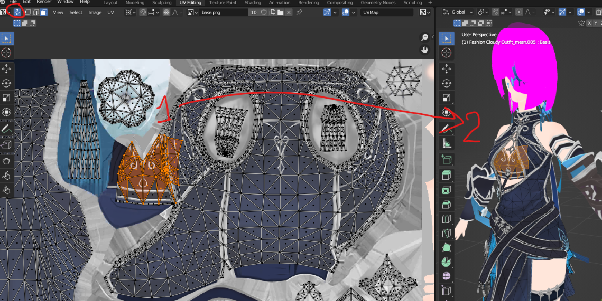

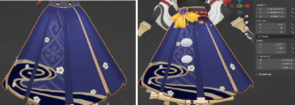

## Позиционирование элемента - Объектный режим

Если вы знаете, как работать в Blender, то хотя бы будете знать, как использовать в Объектном режиме G для захвата объекта, R для его вращения, S для масштабирования и как это делать только вдоль одной оси, если это необходимо (например, GZ переместит объект только вдоль оси Z в 3D-пространстве).

Вы заметите, что, особенно когда вы масштабируете и вращаете объект, он не вращается вокруг себя, а вокруг центра 3D-пространства. Чтобы манипулировать объектом вокруг себя, щелкните правой кнопкой мыши → Установить точку отсчета → Точка отсчета на геометрии.

На изображениях показаны юбка, масштабированная с использованием стандартной точки отсчета и точки отсчета на геометрии. В первом случае юбка поднялась:

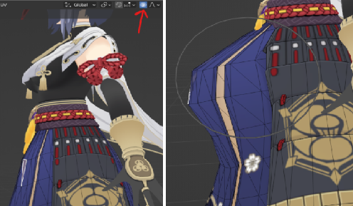

### Пропорциональное редактирование - Режим редактирования

Вы можете использовать Пропорциональное редактирование и масштабировать затронутую область, чтобы перемещать/вращать/масштабировать несколько вершин одновременно — чем дальше от центра области, тем меньше затронуты объекты. Зоны, которые подвергаются и не подвергаются трансформациям, изменяются постепенно, переходя с одной силы на другую.

Результат схож с использованием инструментов для скульптинга, но некоторые вещи проще делать таким способом, особенно вращать или изгибать определенные объекты.

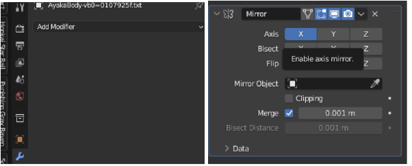

## Модификатор зеркала - Любой режим

Применяется как любой другой модификатор — вы переходите в свойства модификаторов, выбираете Зеркало, затем выбираете ось, вдоль которой должно происходить зеркалирование.

Какие проблемы могут возникнуть при этом?

**Влияние точки отсчета и трансформаций на модификатор:** Модификаторы применяются с учетом точки отсчета и трансформаций, что может вмешаться в результат, если вы изменяли какие-либо из этих свойств. Решение: перейдите в объектный режим и...

**Сбросить точку отсчета:** Щелкните правой кнопкой мыши → Установить точку отсчета → установить точку отсчета обратно на 3D-курсор.
Сбросить трансформации объекта: Ctrl+A → Все трансформации (или только те, которые хотите сбросить).
**Неверное время применения модификатора:** Допустим, вы хотите, чтобы объект был зеркально отражен с обеих сторон оси. Вы добавляете модификатор сначала, затем размещаете или изменяете объект по своему усмотрению... но другая сторона оси не отражает изменения. Это потому, что изменения следует вносить сначала, а затем применять модификатор.

**Неверный порядок модификаторов:** Если вы используете несколько модификаторов, это имеет значение. Проверьте, решает ли изменение порядка их применения возможные проблемы. Модификаторы, расположенные сверху, применяются первыми, а те, что ниже, принимают результат модификатора сверху и применяют его к этому результату.

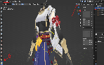

### Интуитивно понятные кисти - Режим скульптинга

**Примечание:** Не забудьте включить зеркалирование, если хотите, чтобы изменения отображались с обеих сторон.

**Примечание 2:** Нажмите F и перетащите мышь, чтобы изменить размер кисти.

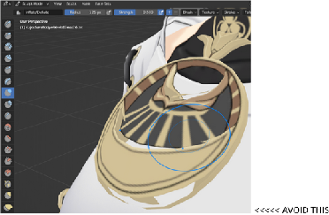

В режиме скульптинга вы можете использовать различные кисти для тонкой настройки формы. Однако... **Grab (горячая клавиша G) — лучший друг новичков. Другие подходящие кисти — это Elastic Deform и другие желтые кисти.**

Из-за того, что некоторые грани не связаны (и новички часто объединяют их больше, чем нужно, поэтому я не рекомендую это), использование кистей, таких как Inflate, может привести к разделению вершин, как на этом изображении:

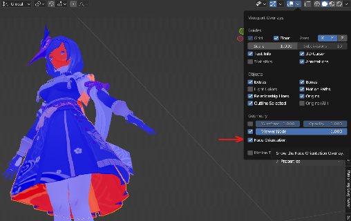

## Просмотр и исправление обратных граней - Режим редактирования

(Это в основном важно для текстур, которых я здесь не рассматриваю, но может повлиять и на другие свойства, поэтому решил все же об этом упомянуть)

Что такое обратные грани? Это грани, которые отображаются красными в этом режиме и обычно не показывают текстуру. Невозможно, чтобы обе стороны грани были синими. Убедитесь, что **сбросили трансформации** модели при проверке, потому что в противном случае информация/цвета могут быть неверными.

Иногда, собирая модель или зеркалируя объекты, вы случайно инвертируете нормали, и Blender начинает считать внешние грани как обратные. Это легко исправить. **Перейдите в Режим редактирования » Выберите эти грани » Alt+N » Перевернуть.** Если забудете горячую клавишу, вы найдете меню Normals в верхней части Режима редактирования — оттуда можно выбрать опцию Пересчитать наружу.

<!--  -->

## Исправления теней/нормалей WIP SECTION (в разработке)

Shade autosmooth

Reset vectors

Add sharp edges

Separate faces

Copy normals
