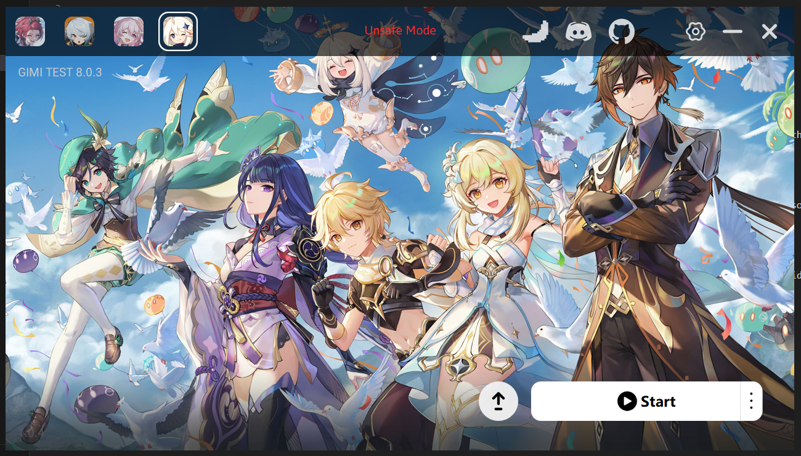
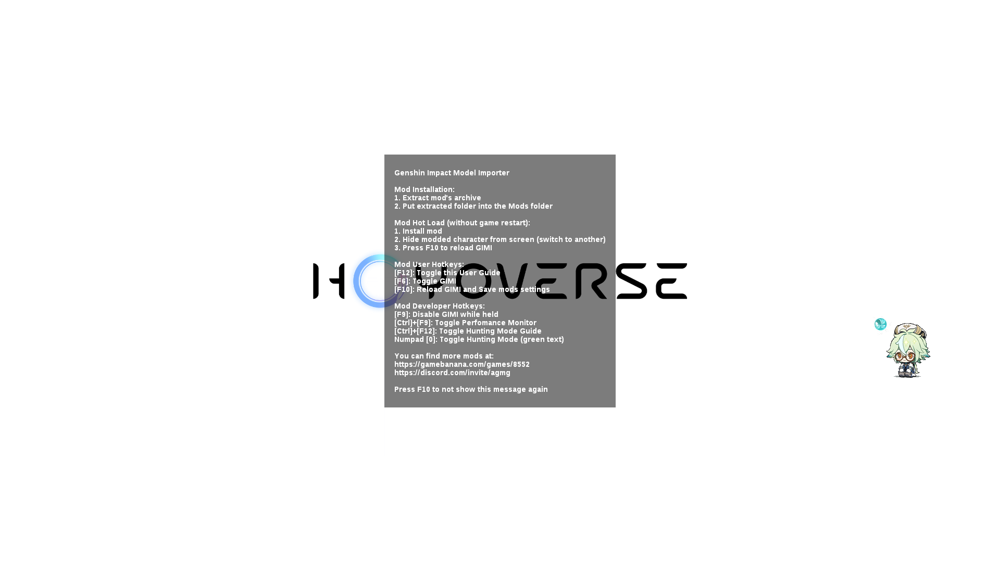
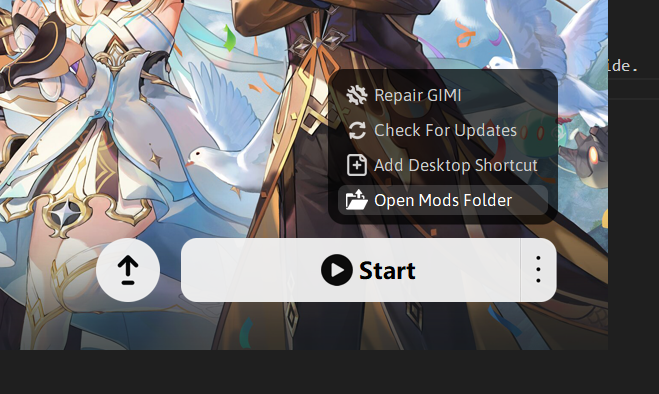

# Начало работы

## Краткое руководство пользователя

1. Скачайте и установите последнюю версию [Launcher](https://github.com/SpectrumQT/XXMI-Launcher/releases/latest) 

2. Запустите лаунчер, выберете нужную вам игру, и нажмите "Start"

    - Перед вами откроется окно, в котором вы узнаете основные сочетания клавиш для использования 3dmigoto. Внимательно прочитайте его и нажмите упомянутую клавишу, чтобы закрыть его.
    
3. **ГОТОВО!** Теперь вы играете с модами. (Курсор c сахарозой не включен в базовой пакет лаунчера :3)

---
Возможно, вы зададитесь вопросом, как это может быть так просто, но на самом деле это так! Лаунчер автоматически загрузит и установит необходимые конфигурации, и вы сможете сосредоточиться на игре и загрузке модов по своему вкусу.

## Установка модов

1. Зайдите на выбранный вами сайт моддинга. Мы рекомендуем [gamebanana.com](https://gamebanana.com), но такие сайты, как [nexusmods.com](https://nexusmods.com) или [loverslab.com](https://loverslab.com), также являются хорошими источниками.
    - [GI mods](https://gamebanana.com/mods/1)
    - [WW mods](https://gamebanana.com/mods/1)
    - [HSR mods](https://gamebanana.com/mods/1)
    - [ZZZ mods](https://gamebanana.com/mods/1)
2. Перейдите на сайт и скачайте мод, который хотите установить. Как правило, они находятся в файле `.zip` со всеми необходимыми файлами внутри.
3. Откройте лаунчер, нажмите на «Открыть папку Mods»

4. [Распакуйте скачанный zip-файл](https://www.google.com/search?q=как+распаковать+.zip+архив) в папку mods.
5. Зайдите в игру и нажмите f10 для быстрой перезагрузки модов.
6. Готово! Теперь вы играете с модами.

Стоит отметить, что некоторые моды могут потребовать загрузки других модов для их работоспособности или даже установки их в определенные папки, поэтому обязательно прочитайте описание мода, чтобы узнать, так ли это.

::: danger
Помните о своей безопасности при скачивании модов, всегда убеждайтесь, что скачиваете их из проверенных источников. Моды состоят только из файлов `.ini`, текстур и 3d-моделей расширения `.buf`. Если какой-либо мод просит вас загрузить исполняемый файл (`.exe`) или `.dll`, то это, скорее всего, вирус. Из этого правила есть исключения, например, инструменты или исправления, для запуска которых требуются файлы `.py` или `.exe`. Подробнее об этом [здесь](#fixing-mods)
:::

## Переход с GIMI/HIMI/SRMI/ZZMI

Если ты переходишь со старых инструментов моддинга, всё предельно просто: **установи новый лаунчер**, следуя инструкциям выше, а затем **перемести содержимое папки `/Mods` в новую папку с модами**.

Ты можешь узнать, где теперь находится папка с модами, нажав кнопку `Open Mods Folder` в лаунчере.

После этого просто **нажми F10 в игре**, чтобы перезагрузить моды, и всё готово! 🚀
