# Руководство 3DMigoto по Хантингу & Дампингу

> Writen by: Satan1c

Этот гайд описывает процесс хантинга и дампинга.

Это полезно, если ты хочешь создать собственный мод с ресурсами, которые не были опубликованы или устарели, или исправить устаревший мод самостоятельно.

В этом руководстве будет краткое описание буферов/шейдеров и пример хантинга и дампинга на персонаже.

## Необходимые условия

Убедись, что у тебя установлен последний [XXMI лаунчер](getting-started.md) и [gui_collect](https://github.com/Petrascyll/gui_collect).

Во время хантинга я рекомендую отключить все моды. Для этого нужно нажать `F6`, однако некоторые моды могут остаться включенными, чаще всего это шейдеры, поэтому лучше переименовать папку `Mods` или добавить `DISABLED` к папкам с модами.

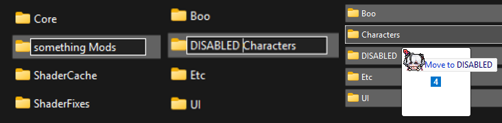

## Настройки лаунчера

По умолчанию моды могут быть отключены, чтобы их включить, открой настройки, затем вкладку MI и активируй хантинг.
> Под вкладкой MI(Model Importer) подразумевается вкладка с нужной тебе игрой в настройках, GI**MI** ZZ**MI** WW**MI** SR**MI**  
Если тебе нужно модифицировать шейдеры а не просто получить свежий хэш, включи "Dump Shaders".

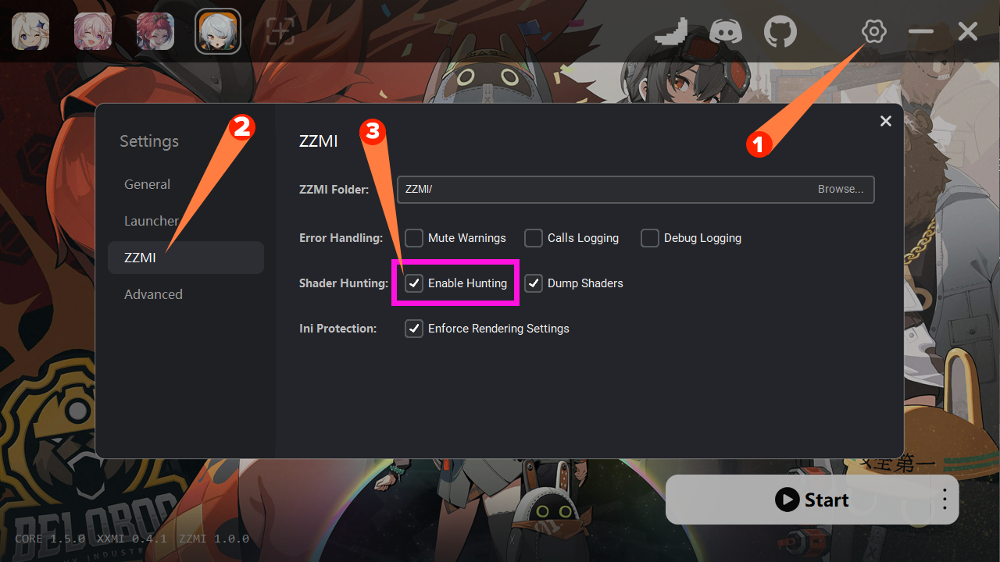

## Управление

После запуска игры, при первом запуске ты увидишь всплывающее окно с управляющими клавишами, если его не видно, нажми `F12`.

Все клавиши можно изменить в файле `d3dx.ini` в разделе `[Hunting]`, используя действительные [виртуальные коды клавиш](https://learn.microsoft.com/en-us/windows/win32/inputdev/virtual-key-codes).

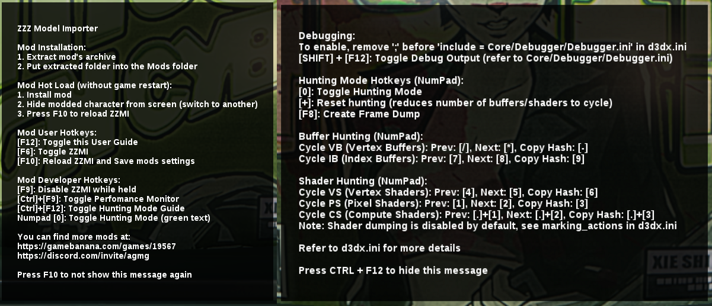

## Действия

### Получение хэшей

Прежде всего, убедись, что хантинг включен, нажми `numpad 0`, ты должен увидеть зелёный текст в верхней и нижней части экрана.

1. Раздел "Counters"

- `VS` - Вершинный шейдер (Vertex Shader)
- `PS` - Пиксельный шейдер (Pixel Shader)
- `IB` - Индексный буфер (Index Buffer)
- `VB` - Вершинный буфер (Vertex Buffer)
- `CS` - Вычислительный шейдер (Compute Shader)

Числа после них отображают `текущий`/`общий счёт` (`current`/`total count`).

2. Хэши (hash)

Отображает хэш, который в данный момент отмечен и может быть скопирован, если была включена опция "Dump Shaders", то шейдер будет сохранён в папке `ShaderFixes`.

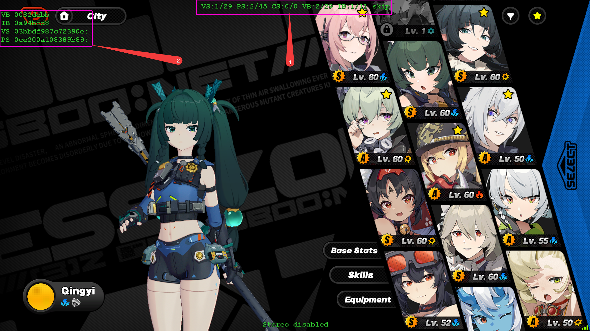

---


### Дампинг

Чтобы получить извлеченный дамп, готовый для импорта в Blender, запустите `gui_collect` с помощью `launch.bat`.

После запуска `gui_collect`, вы увидите следующий интерфейс:

1. Укажите путь к вашей папке MI.
2. Место для скопированного хэша IB из охоты.
3. Название объекта.
   - Используйте только буквы и цифры, не используйте пробелы или не-ASCII символы.
   - Название не повлияет на функциональность, оно нужно для того, чтобы моддеры и пользователи могли понять, что это за часть.
   **Но! Названия должны быть уникальными**.
   - Если IB отвечает за весь объект или большую его часть, то это поле может быть оставлено пустым. В GI обычно есть IB для тела, который можно оставить пустым.
4. Название для всего объекта, имя персонажа и т.д.
   - Используйте только буквы и цифры, не используйте пробелы или не-ASCII символы.
   - Под названием можно выбрать место для создания папки с дампом.
5. Данные модели, указывает, будут ли данные модели (IB, BUF) в папке с дампом.
6. Хэши модели, указывает, будут ли хэши модели включены в результатирующий файл `hash.json`.
7. Данные текстур, указывает, будут ли текстуры в папке с дампом.
8. Хэши текстур, указывает, будут ли хэши текстур включены в результатирующий файл `hash.json`.
9. Последний дамп кадра, автоматически выбирает последний дамп кадра из выбранной папки MI.
10. Извлечь, открывает диалог для выбора активов для включения в дамп, извлеченных из выбранного дампа кадра.

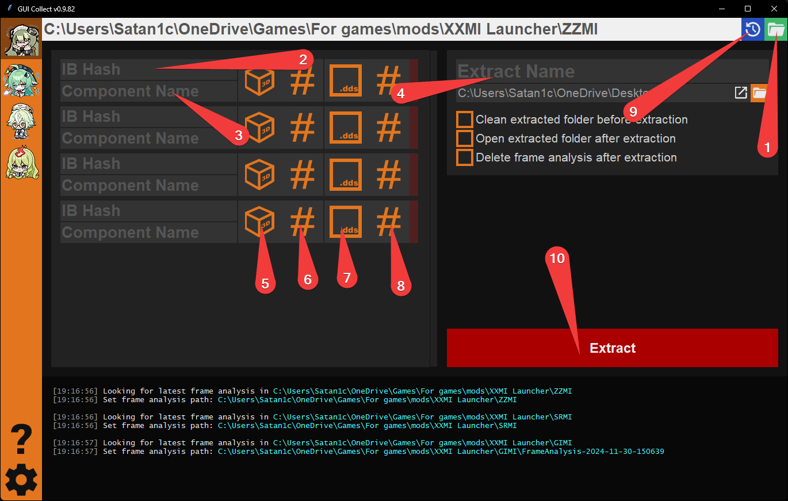

---

Как пример дампинга, я буду делать дамп модели Цинъи.  
Небольшое предупреждение: если вы планируете использовать извлеченные материалы для создания мода, избегайте дампинга лиц или не включайте их хэши/буферы в итоговый дамп. Моддинг лиц не полностью поддерживается, поэтому если вы измените модель лица, она будет сломана в моде. Только текстуру лица можно модифицировать без проблем.

Когда вы маркируете хэш, объект, к которому он принадлежит, исчезнет *(метод маркировки по умолчанию, в качестве альтернативы вы можете изменить `marking_mode` в `d3dx.ini`)*.

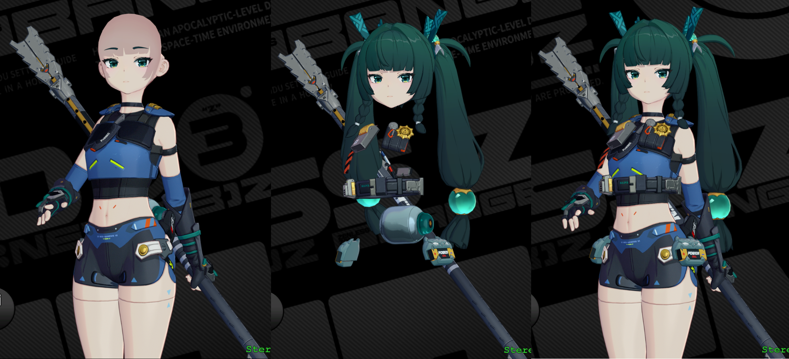

Я получил следующие хэши и вставил их в collect:

- `3cacba0a` - Волосы
- `195857d8` - Тело
- `8e8426df` - Бутылка

Чтобы создать дамп, вам нужно создать папку с дампом кадра, нажав `F8` с включенным режимом `hunting` *(зеленый текст)*.  
Перед этим убедитесь, что вы отключили моды для цели, которую хотите дампить.

После нажатия `F8` игра замерзнет для создания дампа кадра, после завершения выберите последнюю папку и извлеките.

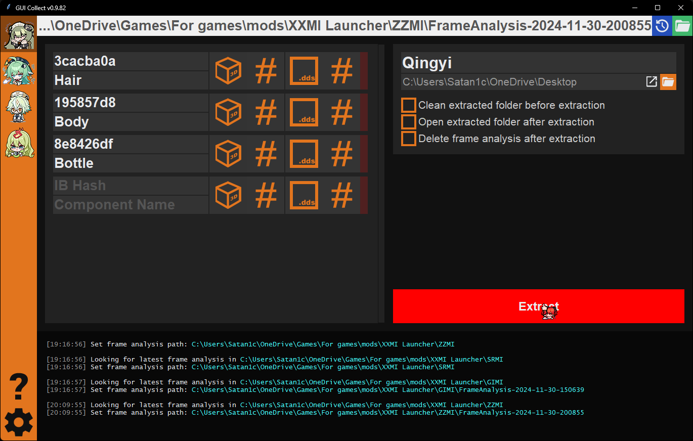

---

В диалоге "Извлечь" вы можете выбрать, какие текстуры и хэши текстур будут включены в дамп.  
В разных играх и между различными объектами одной игры могут быть разные форматы.

Чтобы выбрать, какая текстура какого типа, щелкните по ней ЛКМ и выберите из списка.  
Необходимо выбрать их для всех объектов и нажать "Готово".

Как идентифицировать текстуры:

- Diffuse
  - Полностью окрашенная текстура
- Normal
  - Градиент, заметный эффект объема/бамп
- Light
  - Простая окрашенная текстура
- Material
  - Простая окрашенная текстура с деталями

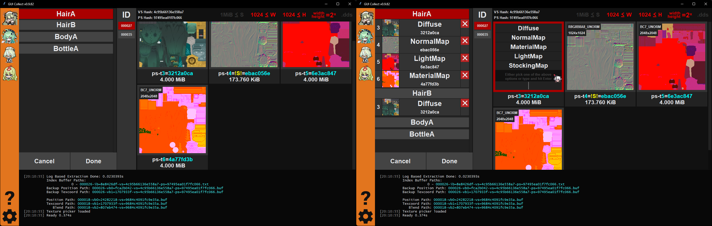

---

### Результат

В результате вы получите ту же папку, с выбранными текстурами и скомпилированными файлами `ib/vb0`, готовыми для импорта в Blender.

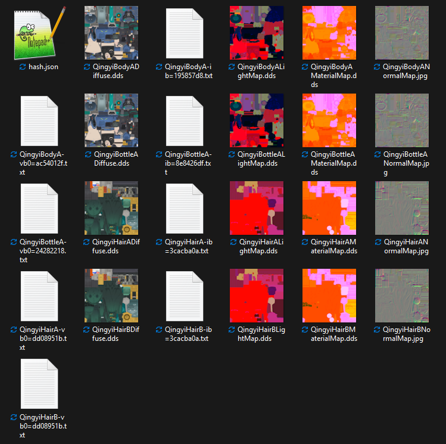

## Целевой дамп

:::warning
Следующий раздел является полностью необязательным
:::

Целевой дамп — это техника, позволяющая делать дамп только выбранных объектов, а не всей сцены, что позволяет уменьшить размер папки дампа с гигабайтов до сотен мегабайт.

### Целевой дамп с gui_collect

Если вы не знаете, как делать обычные дампы с `gui_collect`, сначала прочитайте [этот учебник](../guides/hunting.md)

Включите целевой дамп в `gui_collect`

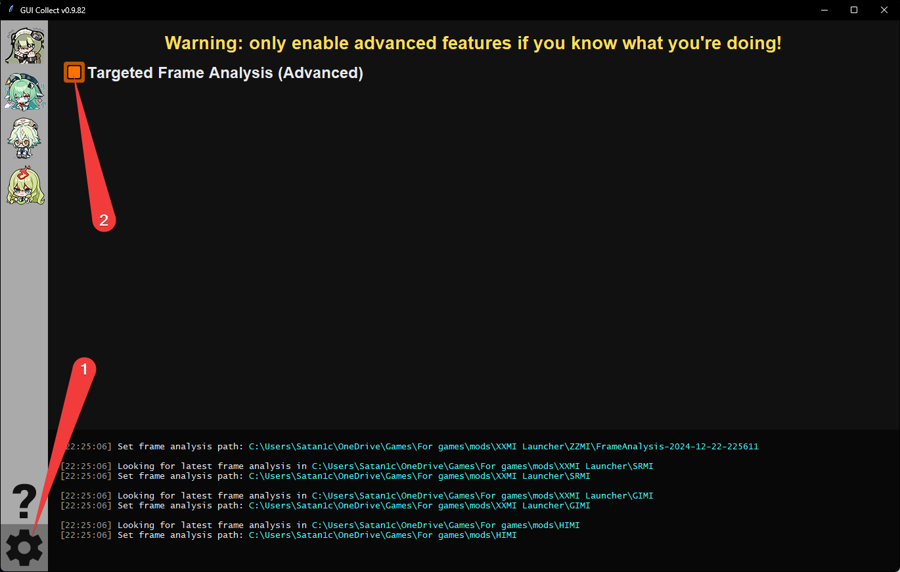

После включения вы увидите следующие опции на странице извлечения:

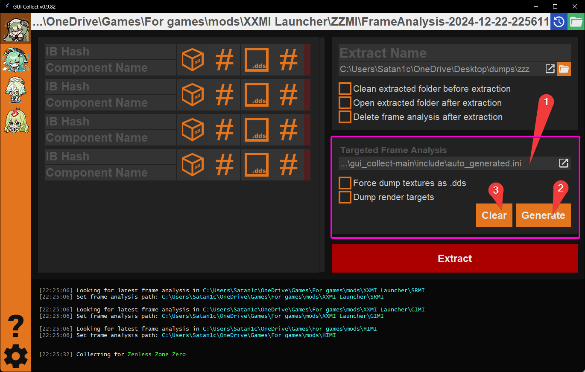

1. поле для нахождения ini с кодом для таргетинга
   - его можно найти в `gui_collect/include/auto_generated.ini`
2. сгенерировать и заполнить кодом таргетинга
3. очистить этот файл

---

Чтобы интегрировать это с игрой, вы можете сделать 2 вещи:

1. добавить вызов `include` в `d3dx.ini`
   - не рекомендуется, так как обновления XXMI могут удалить его
2. создать `ini` с переопределениями параметров для `d3dx.ini`
   - пример ini для этого:
      - поддержка относительных путей в `include`, в примере используется
      - путь переопределений: `Mods/Etc/d3dx overrides.ini`
      - сгенерированный путь: `XXMI Launcher/gui_collect-main/include/auto_generated.ini`

```ini
[Include]
include = ..\..\..\gui_collect-main\include\auto_generated.ini
```

После добавления этого нажмите F10 для обновления конфигураций

Если вы часто нажимаете F10 при дампе или создании мода, вы можете столкнуться с довольно долгими задержками между ними. Чтобы ускорить процесс, вы можете включить кэш шейдеров.

<!-- 
::: danger
Be aware that it may bring some issues,
main issue is updated shader but old cache, that may run into crashes in rare scenarios.
:::

To enable cache, add that to your overrides ini:

```ini
[Rendering]
cache_shaders = 1
```

--- -->

Чтобы использовать новый таргет, заполните секции и нажмите «Сгенерировать», после этого нажмите F10 в игре, теперь вы должны увидеть панель с целевыми объектами, которые будут включены в дамп.

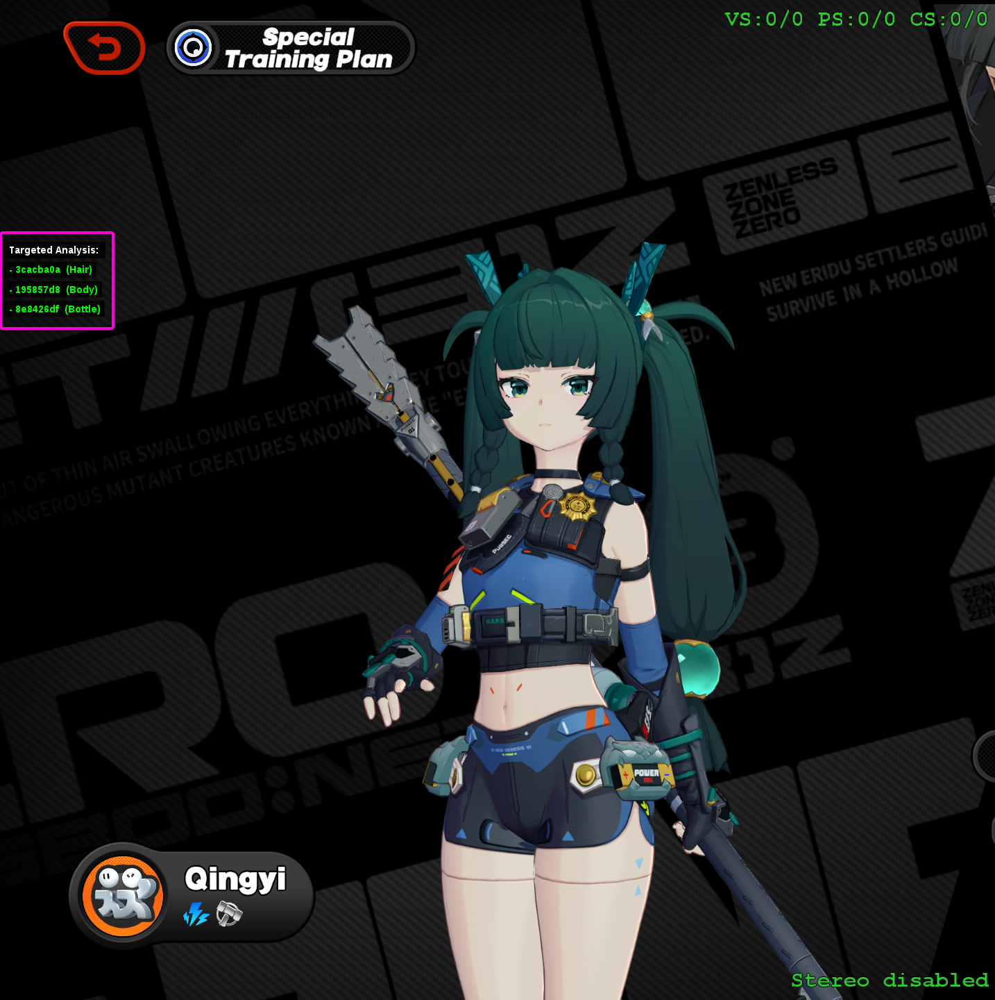

Нажмите F8, и все готово. В моем случае обычный дамп составляет 3.4 ГБ, а с таргетированным — 840 МБ.
