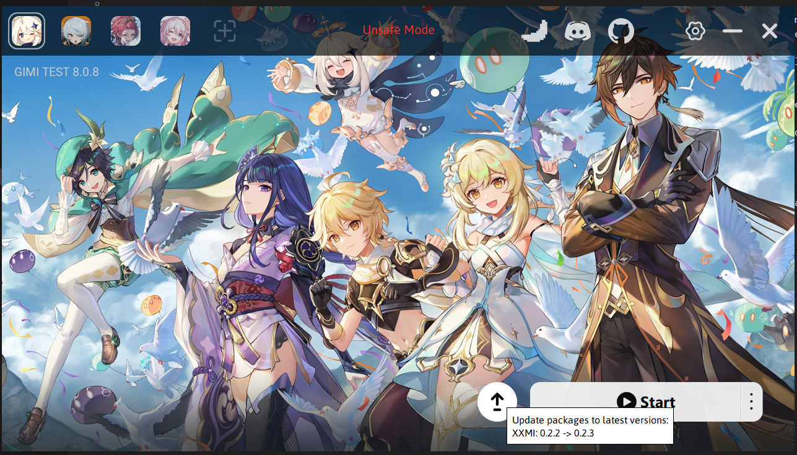

# Лаунчеры

Лаунчеры помогают быстрее настроить конфигурацию 3dmigoto без лишних сложностей. Уже было рекомендовано использование XXMI Launcher в руководстве для начинающих. Этот лаунчер был разработан SpectrumQT, который работает в сообществе AGMG вместе с другими разработчиками. Он значительно упрощает процесс начала использования модов, превращая его в принцип «подключи и играй», а также выполняет роль инструмента для автоматического обновления. Когда игра обновляется, некоторые моды могут выйти из строя, и для их исправления требуются обновления. До использования этого лаунчера такие исправления приходилось выполнять вручную, что приводило к многочисленным ошибкам и путанице со стороны пользователей.

## Другие лаунчеры

Помимо XXMI Launcher, существуют и другие лаунчеры, разработанные различными сообществами. Лично не рекомендуется рекомендовать другие лаунчеры, а некоторые даже следует избегать, поскольку они монетизируют бесплатные и открытые решения без добавления дополнительной ценности по сравнению с уже доступными вариантами. Рекомендуется проявлять осторожность при скачивании и использовании других лаунчеров. Как правило, следует избегать платных вариантов и тех, кто не делится исходным кодом, так как они могут втихую внедрять код, о котором пользователь не будет осведомлен.

## XXMI Launcher

Данный лаунчер будет рассматриваться более подробно, но другие лаунчеры, вероятно, будут иметь ту же функциональность, реализованную в другой форме.

### Обновления в один клик

Лаунчер автоматически проверяет наличие обновлений и скачивает их для пользователя. Это удобная функция, так как она гарантирует, что пользователь всегда будет в курсе последних исправлений и улучшений. Если автоматическое обновление будет отключено, обновления будут отображаться на главном экране, и пользователь сможет обновить их вручную в любое удобное время.

### Поддержка FPS Unlocker и Reshade

FPS Unlocker идет в комплекте с лаунчером для тех игр, которые поддерживают эту функцию. Для активации достаточно выбрать желаемую частоту кадров в настройках. После перезапуска игры FPS Unlocker будет активен, и игра будет запускаться с заданной частотой кадров.

Что касается Reshade, он не входит в комплект, однако настройка обычно достаточно проста.
Для этого имеется руководство от caverabbit: <https://gamebanana.com/tools/18082>

### Добавление функционала в лаунчер

В разделе ADVANCED в настройках можно настроить предустановленные и постустановленные скрипты/программы, которые будут запускаться до и после старта игры. Это можно использовать для запуска любых дополнительных программ, которые могут быть полезны при использовании модов. Reshade является примером такого функционала. Например, пользователь может настроить Python-скрипт для случайного выбора наряда персонажа на игровую сессию. Возможности расширены. Рекомендуется экспериментировать и обсуждать идеи с сообществом. Даже если создание таких скриптов не представляется возможным, другие участники сообщества могут оказать помощь. Моддинг не должен ограничиваться только 3D-моделями; любой контент, добавляющий разнообразие в игровой процесс, приветствуется.
